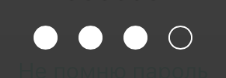

# ELNViews

Коллекция UIKit вьюх:

- ELNLabel
- ELNScrollView
- ELNPINTextField

## Installation

###Cocoapods

```
source 'https://github.com/CocoaPods/Specs.git'
source 'https://github.com/elegion/ios-podspecs'

pod 'ELNViews' 
```

###Carthage

```
github 'elegion/ios-ELNViews'
```

## Views 

###ELNLabel

Лейбл, который автоматически ресайзится по высоте в iOS7+. Настройка:

- использовать автолейут в  xib
- установить для лейбла `numberOfLines = 0` и `preferredMaxLayoutWidth = 0`.

###ELNScrollView

Скролл вью, который не отменяет скрол при нажатии на `UIButton` и прочие `UIControl` подклассы.

### ELNPINTextField

Поле для ввода пинкода. Реализует протокол `UIKeyInput`. 

## Contribution

###Cocoapods

```sh
# download source code, fix bugs, implement new features

pod repo add legion https://github.com/elegion/ios-podspecs
pod repo push legion ELNViews.podspec
```